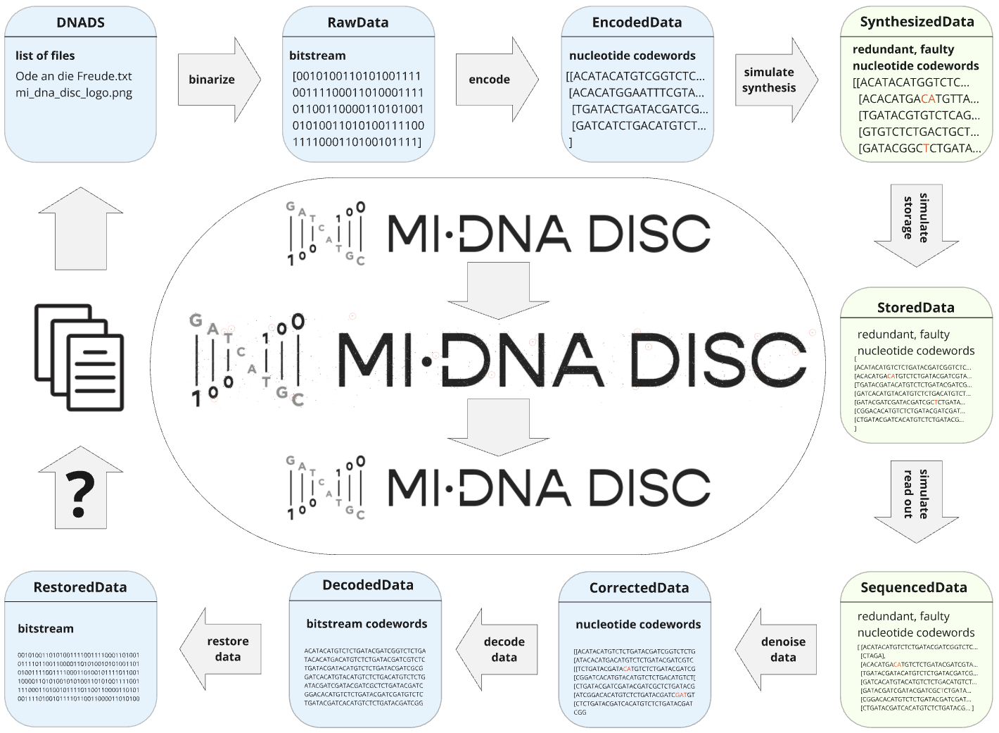

# Overview

**DNAbyte** is a comprehensive toolkit for DNA data storage. It provides a framework for the simulation and analysis of the complete end-to-end pipeline of DNA data storage, including:
 
1. **File Binarization**: Converts input files into a compressed binary format suitable for encoding.
2. **Encoding**: Translates binary data into DNA sequences using various encoding strategies and error correction schemes.
4. **Simulation**: Provides configurable error channels for (i) DNA synthesis, (ii) storage, and sequencing.
5. **Decoding**: Decodes and error-corrects the DNA back to binary and restores the original file.

---

## Structure of this Documentation

* The [Usage](usage.md) section provides example code for running an end-to-end data storage pipeline, including detailed explanations of all configurable parameters.

* For step-by-step guidance on executing simulations, refer to the [Simulation](simulation.md) section.

* To gain a deeper understanding of the core concepts—especially encoding techniques—see the [Concepts](concepts.md) section.

* The [Reference](reference.md) section offers comprehensive documentation for all functions and classes within the DNAbyte module.

---

Eko Refugium is part of the MI-DNA DISC consortium. (www.midnadisc.eu)
MI-DNA DISC was funded by the EU Commission in the framework of the Horizon Europe – EIC Pathfinder Challenges programme. Grant Agreement 101115215
